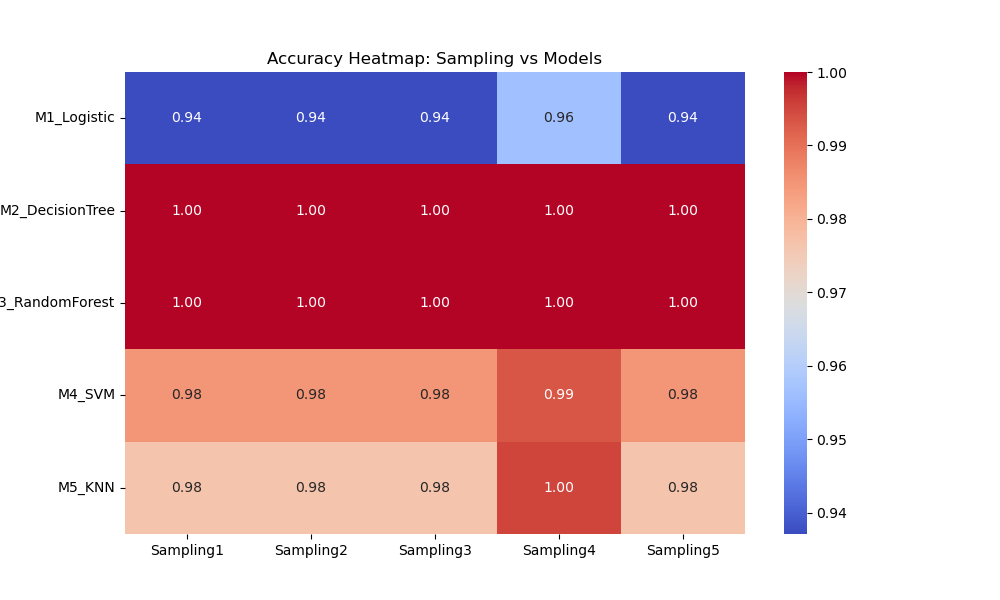
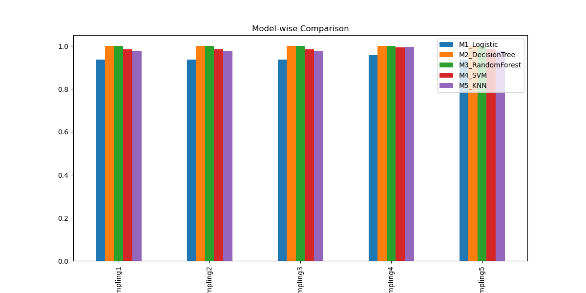
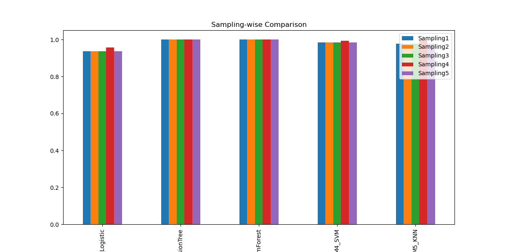

# Sampling Assignment – Imbalanced Credit Card Dataset

## Objective
To analyze how different sampling techniques affect the performance of machine learning models on a highly imbalanced credit card dataset.

---

## Dataset
- **Creditcard_data.csv**
- Binary classification problem (Fraud / Non-Fraud)
- Dataset is highly imbalanced

---

## Methodology
1. Loaded and analyzed the original imbalanced dataset  
2. Converted the dataset into a balanced dataset using **SMOTE**  
3. Created **five samples** from the balanced dataset  
4. Applied **five different sampling techniques**  
5. Trained **five machine learning models**  
6. Compared results using accuracy tables and visualizations  

---

## Dataset Balancing
The original dataset was highly imbalanced.  
SMOTE was used to generate synthetic samples for the minority class so that both classes have equal representation.

---

## Sampling Techniques Used
- **Sampling1** – Random Under Sampling  
- **Sampling2** – Random Over Sampling  
- **Sampling3** – SMOTE  
- **Sampling4** – SMOTE + ENN  
- **Sampling5** – SMOTE + Tomek Links  

---

## Machine Learning Models
- **M1** – Logistic Regression  
- **M2** – Decision Tree  
- **M3** – Random Forest  
- **M4** – Support Vector Machine  
- **M5** – K-Nearest Neighbors  

---

## Results

### Accuracy Table
Accuracy values for each combination of sampling technique and model were calculated and stored in tabular form.


---

### Accuracy Heatmap
The heatmap below shows how model accuracy varies with different sampling techniques.



---

### Model-wise Comparison
This bar plot compares the performance of each model across all sampling techniques.



---

### Sampling-wise Comparison
This bar plot compares how different models perform under each sampling technique.



---

## Conclusion
- Sampling techniques significantly influence model performance  
- Oversampling and hybrid techniques generally outperform undersampling  
- Random Forest showed strong and consistent performance across sampling methods  
- Proper handling of class imbalance is essential for reliable machine learning models  

---
---

## How to Run
1. Install dependencies:
   pip install -r requirements.txt

2. Run the notebook:
   notebooks/sampling_analysis.ipynb

---


##  Project Structure

```

├── data/
│   ├── Creditcard_data.csv          
│   ├── balanced_data.csv             
│   ├── sample_1.csv                  
│   ├── sample_2.csv                  
│   ├── sample_3.csv                  
│   ├── sample_4.csv                 
│   └── sample_5.csv                  
├── notebooks/
│   └── sampling_analysis.ipynb       
├── results/
│   ├── accuracy_table.csv           
│   ├── accuracy_heatmap.png          
│   ├── model_comparison.png          
│   └── sampling_comparison.png       
├── requirements.txt                  
└── README.md                         
